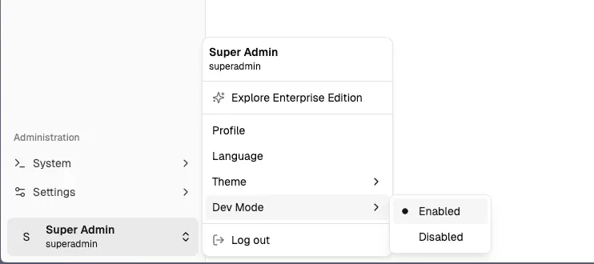

import Tabs from '@theme/Tabs';
import TabItem from '@theme/TabItem';

This guide covers the core concepts and best practices for extending the Vendure Dashboard. Understanding these fundamentals will help you build robust and maintainable dashboard extensions.

## Dev Mode

Once you have logged in to the dashboard, you can toggle on "Dev Mode" using the user menu in the bottom left:



In Dev Mode, hovering any block in the dashboard will allow you to find the corresponding `pageId` and `blockId` values, which you can later use when customizing the dashboard. This is essential for:

- Identifying where to place custom page blocks
- Finding action bar locations
- Understanding the page structure
- Debugging your extensions


## Recommended Folder Structure

While you can organize your dashboard extensions however you prefer (it's a standard React application), we recommend following this convention for consistency and maintainability:

```
src/plugins/my-plugin/
└── dashboard/
    ├── index.tsx           # Main entrypoint linked in plugin decorator
    ├── pages/              # Top-level page components
    ├── routes/             # Route definitions
    ├── form-components/    # Input, custom fields, and display components
    ├── detail-forms/       # Detail form definitions
    └── action-bar/         # Action bar items
```

### Entry Point (index.tsx)

The main entry point that is linked in your plugin decorator:

```tsx title="src/plugins/my-plugin/dashboard/index.tsx"
import { defineDashboardExtension } from '@vendure/dashboard';

export default defineDashboardExtension({
    routes: [],
    navSections: [],
    pageBlocks: [],
    actionBarItems: [],
    alerts: [],
    widgets: [],
    customFormComponents: {},
    dataTables: [],
    detailForms: [],
    login: {},
});
```

:::tip
This folder structure is particularly important when open-sourcing Vendure plugins. Following the official conventions makes it easier for other developers to understand and contribute to your plugin.
:::

## Form Handling

Form handling in the dashboard is powered by [react-hook-form](https://react-hook-form.com/), which is also the foundation for Shadcn's form components. This provides:

- Excellent performance with minimal re-renders
- Built-in validation
- TypeScript support
- Easy integration with the dashboard's UI components

### Basic Form Example

```tsx
import { useForm } from 'react-hook-form';
import { FormFieldWrapper, Input, Button } from '@vendure/dashboard';

function MyForm() {
    const form = useForm({
        defaultValues: {
            name: '',
            email: '',
        },
    });

    const onSubmit = data => {
        console.log(data);
    };

    return (
        <form onSubmit={form.handleSubmit(onSubmit)}>
            <FormFieldWrapper
                control={form.control}
                name="name"
                label="Name"
                render={({ field }) => <Input {...field} />}
            />
            <FormFieldWrapper
                control={form.control}
                name="email"
                label="Email"
                render={({ field }) => <Input type="email" {...field} />}
            />
            <Button type="submit">Submit</Button>
        </form>
    );
}
```

### Advanced Example

For a comprehensive example of advanced form handling, including complex validation, dynamic fields, and custom components, check out the [order detail page implementation](https://github.com/vendure-ecommerce/vendure/blob/master/packages/dashboard/src/app/routes/_authenticated/_orders/orders_.%24id.tsx) in the Vendure source code.

## API Client

The API client is the primary way to send queries and mutations to the Vendure backend. It handles channel tokens and authentication automatically.

### Importing the API Client

```tsx
import { api } from '@vendure/dashboard';
```

The API client exposes two main methods:

- `query` - For GraphQL queries
- `mutate` - For GraphQL mutations

### Using with TanStack Query

The API client is designed to work seamlessly with TanStack Query for optimal data fetching and caching:

#### Query Example

```tsx
import { useQuery } from '@tanstack/react-query';
import { api } from '@vendure/dashboard';
import { graphql } from '@/gql';

const getProductsQuery = graphql(`
    query GetProducts($options: ProductListOptions) {
        products(options: $options) {
            items {
                id
                name
                slug
            }
            totalItems
        }
    }
`);

function ProductList() {
    const { data, isLoading, error } = useQuery({
        queryKey: ['products'],
        queryFn: () =>
            api.query(getProductsQuery, {
                options: {
                    take: 10,
                    skip: 0,
                },
            }),
    });

    if (isLoading) return <div>Loading...</div>;
    if (error) return <div>Error: {error.message}</div>;

    return <ul>{data?.products.items.map(product => <li key={product.id}>{product.name}</li>)}</ul>;
}
```

#### Mutation Example

```tsx
import { useMutation, useQueryClient } from '@tanstack/react-query';
import { api } from '@vendure/dashboard';
import { graphql } from '@/gql';
import { toast } from 'sonner';

const updateProductMutation = graphql(`
    mutation UpdateProduct($input: UpdateProductInput!) {
        updateProduct(input: $input) {
            id
            name
            slug
        }
    }
`);

function ProductForm({ product }) {
    const queryClient = useQueryClient();

    const mutation = useMutation({
        mutationFn: input => api.mutate(updateProductMutation, { input }),
        onSuccess: () => {
            // Invalidate and refetch product queries
            queryClient.invalidateQueries({ queryKey: ['products'] });
            toast.success('Product updated successfully');
        },
        onError: error => {
            toast.error('Failed to update product', {
                description: error.message,
            });
        },
    });

    const handleSubmit = data => {
        mutation.mutate({
            id: product.id,
            ...data,
        });
    };

    return (
        // Form implementation
        <form onSubmit={handleSubmit}>{/* Form fields */}</form>
    );
}
```

## Best Practices

1. **Follow the folder structure**: It helps maintain consistency, especially when sharing plugins
2. **Use TypeScript**: Take advantage of the generated GraphQL types for type safety
3. **Leverage TanStack Query**: Use it for all data fetching to benefit from caching and optimistic updates
4. **Handle errors gracefully**: Always provide user feedback for both success and error states
5. **Use the dashboard's UI components**: Maintain visual consistency with the rest of the dashboard
6. **Test in Dev Mode**: Use Dev Mode to verify your extensions are placed correctly

## What's Next?

Now that you understand the fundamentals of extending the dashboard, explore these specific guides:

- [Navigation](/guides/extending-the-dashboard/navigation/) - Add custom navigation sections
- [Page Blocks](/guides/extending-the-dashboard/page-blocks/) - Enhance existing pages
- [Action Bar Items](/guides/extending-the-dashboard/action-bar-items/) - Add custom actions
- [Custom Form Components](/guides/extending-the-dashboard/custom-form-components/) - Build specialized inputs
- [CMS Tutorial](/guides/extending-the-dashboard/cms-tutorial/) - Complete walkthrough example
